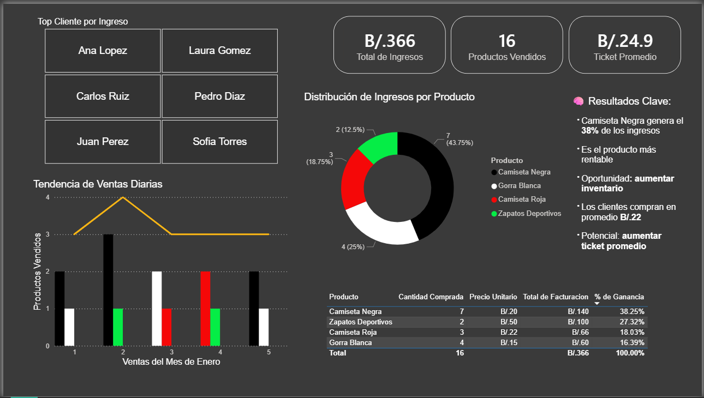
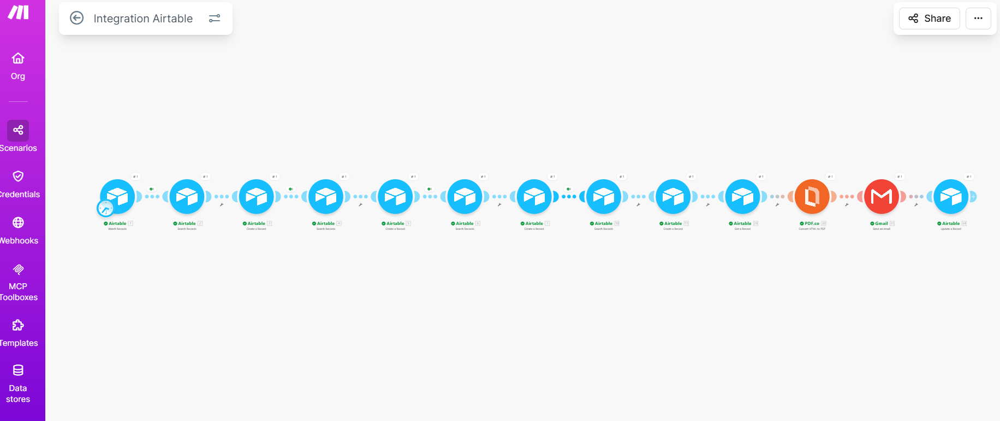
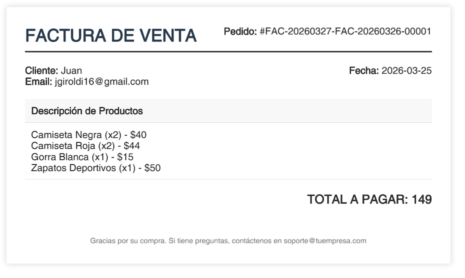

# 🚀 Business Process Automation System

## 🧠 Overview

This project demonstrates how a business can eliminate manual work, reduce errors, and gain full visibility by optimizing and automating its core processes.

Instead of just automating tasks, this system was designed to improve how the business operates.

---

## 🚨 The Problem

Many businesses handle operations manually:

- Orders are recorded in spreadsheets
- Invoices are created manually
- Emails are sent one by one
- Data is fragmented and hard to analyze

This leads to:
- Time loss
- Human errors
- Limited scalability
- Lack of decision-making clarity

---

## ⚙️ The Solution

A complete system was designed and implemented:

### 🗂️ Centralized Data (Airtable)
- Orders, clients, and invoices in one place
- Structured and scalable database

### ⚙️ Process Automation (Make)
- Automatic trigger when a new order is created
- Invoice generation
- Automatic email delivery
- Status update in real time

### 📊 Business Intelligence (Power BI)
- Executive dashboard
- Sales insights
- Performance tracking
- Decision-making support

---

## 🔄 Workflow

Order Created → Invoice Generated → Email Sent → Data Updated → Dashboard Updated

---

## 📊 Results

✔ Reduced manual work  
✔ Eliminated repetitive tasks  
✔ Improved accuracy  
✔ Increased visibility of business performance  

---

## 💡 Key Insight

Automation alone is not enough.

The real impact comes from:
→ analyzing the process  
→ optimizing it  
→ then automating it  

---

## 🖼️ System Overview

### 📊 Dashboard

### 🗂️ Airtable System

### ⚙️ Automation Workflow

### 🧾 Invoice 

---

## 📩 Work With Me

I help businesses optimize and automate their processes using data and intelligent systems.

If your business still relies on manual work, there is a clear opportunity to improve.

This project is based on a simple principle:

Optimize first, then automate.

This ensures that the system is efficient, scalable, and aligned with business goals.
